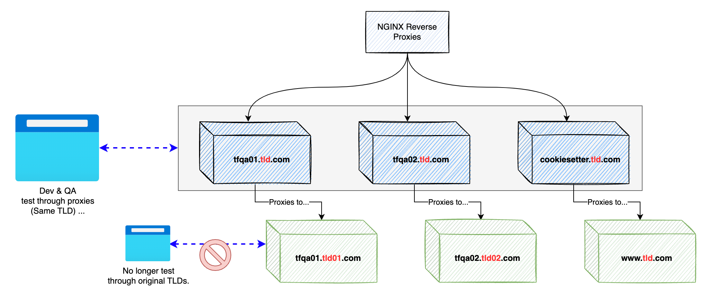
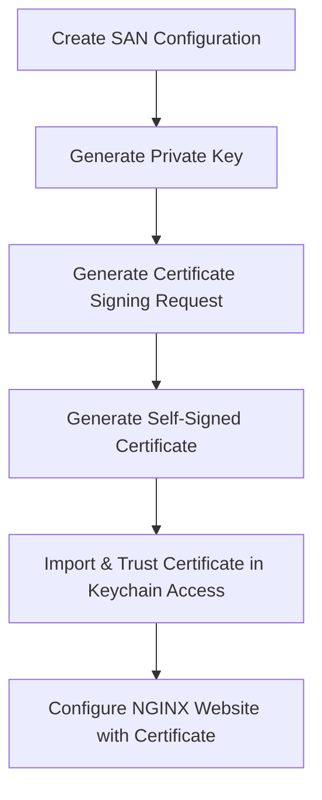
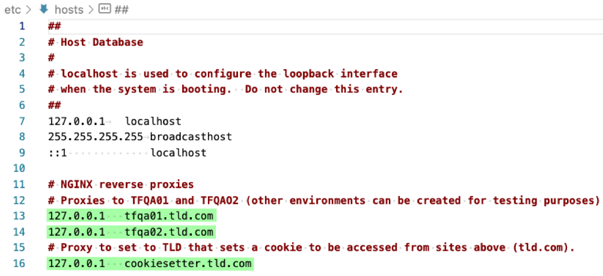

# Reverse Proxy Setup

This is a setup guide to generate a website (website.com) that proxies to another website (anotherwebsite.com) for the purpose of changing the domain for testing purposes.



This guide works through:

1. Installing NGINX via homebrew.
2. Configuring NGINX to proxy a site (anotherwebsite.com) through a new website (website.com)
    
    a. Ensuring site runs on ports 80 and 443

3. Establishing a self-signed certificate for the site
    
    a. Installing the certificate in the Mac Keychain Access and trusting it.

4. Configuring the Host file to redirect traffic going to (website.com) to your local reverse-proxy instance

## Installing NGINX (Assuming OSX)

Using homebrew, run the following commands:

`brew install nginx`

Command to start NGINX:

`brew services start nginx`

Command to restart NGINX:

`brew services restart nginx`

Important Folder Locations:

1. Configuration File: `/usr/local/etc/nginx/nginx.conf`
2. Sites: `/usr/local/var/www/`
3. Certificates: `/usr/local/var/ssl/`
4. Logs: `/usr/local/var/log/nginx/`
5. Hosts File: `/private/etc/hosts`

## Configure NGINX as a reverse proxy

Create a server for **website.com** on port **80** and port **443** to serve resources from **anotherwebsite.com**.

``` nginx
    server {
        listen       80;
        # Update hosts file to include website.com pointing to 127.0.0.1
        server_name  website.com; 

        location / {
            # This is the site your proxying to...
            proxy_pass https://anotherwebsite.com/; 
        }
    }

    # ...
    server {
        listen      443 ssl;
        server_name website.com;

        # The certificate information (configured later) 
        ssl_certificate /usr/local/var/ssl/website.com/website.com.crt;
        ssl_certificate_key /usr/local/var/ssl/website.com/website.com.key;

        ssl_protocols TLSv1.2 TLSv1.3;
        ssl_prefer_server_ciphers on;
        ssl_ciphers "EECDH+AESGCM:EDH+AESGCM:AES256+EECDH:AES256+EDH";
      
        location / {
            proxy_pass http://website.com:80;
            proxy_set_header Host $host;
            proxy_set_header X-Real-IP $remote_addr;
            proxy_set_header X-Forwarded-For $proxy_add_x_forwarded_for;
            proxy_set_header X-Forwarded-Proto $scheme;
        }
    }
```

## Generating Self-Signed Certifcates

Below are steps to generate and use a self-signed certificate for a site (website.com):



Scripts to generate the certificate:

```bash
# Create working directory to store SSL generated files
mkdir /usr/local/var/ssl/website.com && \
cd    /usr/local/var/ssl/website.com

# Create Subject Alternate Name (SAN) configuration
echo \
[ req ]                                     $'\n'\
default_bits       = 2048                   $'\n'\
distinguished_name = req_distinguished_name $'\n'\
req_extensions     = req_ext                $'\n'\
prompt             = no                     $'\n\n'\
[ req_distinguished_name ]                  $'\n'\
C  = US                                     $'\n'\
ST = State                                  $'\n'\
L  = Location                               $'\n'\
O  = Organization                           $'\n'\
OU = Organizational Unit                    $'\n'\
CN = website.com                            $'\n\n'\
[ req_ext ]                                 $'\n'\
subjectAltName = @alt_names                 $'\n\n'\
[ alt_names ]                               $'\n'\
DNS.1 = website.com > website.com_san.conf

# Generate Private Key
openssl genpkey -algorithm RSA -out website.com.key -pkeyopt rsa_keygen_bits:2048

# Generate Certificate Signing Request
openssl req -new -key website.com.key -out website.com.csr -config website.com_san.conf

# Generate Self-Signed Certificate
openssl x509 -req -in website.com.csr -signkey website.com.key -out website.com.crt -days 365 -extfile website.com_san.conf -extensions req_ext

# Import Certificate in Keychain Access
sudo security add-trusted-cert -d -r trustRoot -k /Library/Keychains/System.keychain website.com.crt
```

Once the scripts have been ran to generate a certificate, it should be trusted and available in the Keychain Access.

```text
total 32
drwxr-xr-x  6 user01  admin   192 Aug  8 22:32 .
drwxr-xr-x  8 user01  admin   256 Aug  8 22:32 ..
-rw-r--r--  1 user01  admin  1359 Aug  8 22:32 website.com.crt
-rw-r--r--  1 user01  admin  1086 Aug  8 22:32 website.com.csr
-rw-------  1 user01  admin  1704 Aug  8 22:32 website.com.key
-rw-r--r--  1 user01  admin   318 Aug  8 22:32 website.com_san.conf
```

Finally, make sure your new certificate and private key are configured in the `nginx.conf` file (as shown earlier).

``` nginx
# The certificate information (configured later) 
ssl_certificate /usr/local/var/ssl/website.com/website.com.crt;
ssl_certificate_key /usr/local/var/ssl/website.com/website.com.key;
```

## Configuring the hosts file

Note: Your hosts (`/private/etc/hosts`) file will need to include your new website as shown below:

``` ini
# /private/etc/hosts
# Sample Test Website
127.0.0.1   website.com
```

### Sample Hosts file:



Once everything is setup, start NGINX and test the site by navigating to it in your browser.
